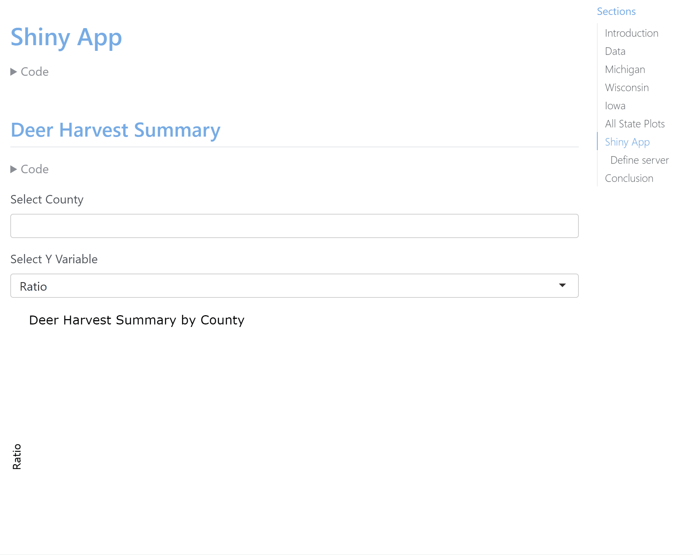

# Deer Project in R

The following project gathers deer harvest data from multiple states using csv, excel, and manual entry techniques. Data visualization and analysis is performed on the information of the states individually and together with other states. Bar, point, heatmaps, and interactive graphs are displayed. Use of self hosting to display the interactive apps and GUI for dynamic display is necessary to view most of the graphs in the html. 

* Two demos below illustrating self hosting interactive visualizations (can be found in demo folder).
* Run the .qmd file in RStudio to get a working quarto document.
* .html file will not show any visualizations that are run on the "server" / part of the self hosting .
* Remove plotly and shiny app features to get non-interactive plots that will appear with only the html download and no self hosting necessary.
* state_deer.R files are individual data extractions pertaining to that state. Binding the data together is implemented in the .qmd file.

## Demo

## Demo for embedded app

